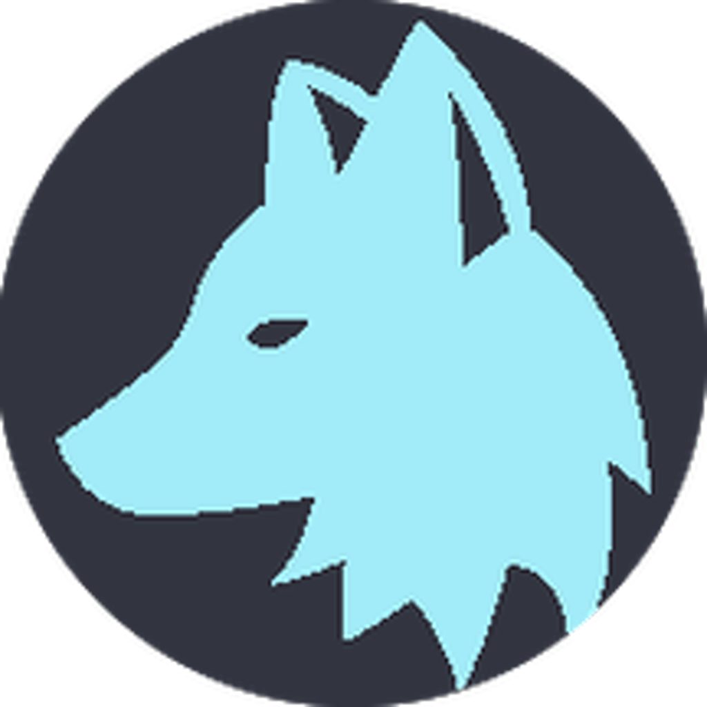

# KioT-dl

    <a href="">Mac OS</a> | <a href="">Linux</a> | <a href="">Windows</a>

 KioT-dl ( pronounced <i>kai·ow·tee dee·el<i> ), or <b>K</b>eep <b>i</b>t <b>o</b>n <b>T</b>he <b>d</b>own <b>l</b>ow, is a cross platform desktop app for scraping music using Google, Genius.com, & Youtube 

This project is just getting started, feel free to try it out yourself, and offer feedback for new features! 

Directory
- [Install](#install)
- [Building](#bulding)
- [TODO](#todo)
- [Motivation](#motivation)
- [References](#references)

## Install 

## Bulding

## TODO
- [ ] Electron forge ignore extra files

## Motivation
There were several cool challanges while maiking this project
- Cross platform native app - solved by electron
- Easier coms development - Enabled http to avoid electrons default coms api
- Develpment vs Production - env variabiles point the window towards vites dev port to enable hot module replacement (live updates to the view)
- Persistant Database with fuzzy search - node-json-db + Fuse.js

## References
https://www.electronjs.org/docs/latest/tutorial/code-signing - code signing
https://thenounproject.com/browse/icons/term/coyote/ - source of icon
https://makeappicon.com/ - make icons
https://www.electronforge.io/config/makers/dmg - how to add background image for mac dmg
https://creatomate.com/blog/how-to-use-ffmpeg-in-nodejs - static-ffmpeg
https://stackoverflow.com/questions/59800915/how-can-i-execute-a-custom-ffmpeg-string-command-with-fluent-ffmpeg - ffmpeg wrapper
https://www.fusejs.io/api/options.html#threshold - fuse search engine 
https://www.svgrepo.com/svg/528951/download-minimalistic?edit=true - jtml svg's
